### - What is the packages is a prerequisite for installing Jenkins ?

### 1. **Java Development Kit (JDK)**

- Jenkins requires Java to run. You'll need to install the **JDK (Java Development Kit)**, specifically Java 11 or later (Java 17 is also supported).
  - On Debian/Ubuntu-based systems:
    ```bash
    sudo apt update
    sudo apt install openjdk-11-jdk
    ```
  - On RHEL/CentOS/Fedora-based systems:
    ```bash
    sudo dnf install java-11-openjdk
    ```

### 2. **wget or curl**

- Used to download Jenkins packages or repository keys.
  - To install on Ubuntu/Debian:
    ```bash
    sudo apt install wget
    ```
  - To install on RHEL/CentOS/Fedora:
    ```bash
    sudo dnf install wget
    ```

### 3. **gnupg (for Ubuntu/Debian)**

- Needed to add Jenkins repository keys.
  ```bash
  sudo apt install gnupg
  ```

### 4. **Optional Packages**

- **git**: If you plan to integrate Jenkins with version control systems like Git.
  ```bash
  sudo apt install git   # for Debian/Ubuntu
  sudo dnf install git   # for RHEL/CentOS/Fedora
  ```
- **Docker**: If you're planning to use Jenkins for building Docker images.
  ```bash
  sudo apt install docker.io    # for Ubuntu
  sudo dnf install docker       # for CentOS/Fedora
  ```

### 5. **Firewall Settings**

- Ensure that port `8080` (default Jenkins port) is open in the firewall.

Once these prerequisites are met, you can proceed with installing Jenkins.

### Run this command and tell me the ssh port: `curl -Lv http://localhost:8085/login 2>&1 | grep -i 'x-ssh-endpoint'`

### What are jenkins plugins?

    A. Plugins are used to configure the security settings in Jenkins.
    B. Plugins are the primary means of enhancing the functionality of a Jenkins      environment to suit organization or user specific needs.
    C. Plugins are used to create jobs in Jenkins.
    D. Plugins are the tools to setup CI/CD pipelines in Jenkins.

The correct answer is:
**B. Plugins are the primary means of enhancing the functionality of a Jenkins environment to suit organization or user specific needs.**

### Can we install the .hpi plugin file from Jenkins web UI?

Yes, you can install `.hpi` plugin files from the Jenkins web UI.

### Make sure that Git and Github plugins are installed if it's not kindly install them

All Installed

### Install Jenkins as normal service or as docker container (bouns install it using ansible)

### 1. **Installing Jenkins as a Normal Service with Ansible**

#### Ansible Playbook for Jenkins as a Service (Ubuntu Example):

```yaml
---
- hosts: jenkins_server
  become: yes
  tasks:
    - name: Update apt package manager
      apt:
        update_cache: yes

    - name: Install Java (required for Jenkins)
      apt:
        name: openjdk-11-jdk
        state: present

    - name: Add Jenkins repository key
      apt_key:
        url: https://pkg.jenkins.io/debian-stable/jenkins.io.key
        state: present

    - name: Add Jenkins apt repository
      apt_repository:
        repo: deb http://pkg.jenkins.io/debian-stable binary/
        state: present

    - name: Install Jenkins
      apt:
        name: jenkins
        state: present

    - name: Start Jenkins service
      systemd:
        name: jenkins
        state: started
        enabled: true

    - name: Ensure port 8080 is open in the firewall
      ufw:
        rule: allow
        port: 8080
        proto: tcp
```

### Steps to Run the Playbook:

1. Save the playbook to a file, e.g., `install_jenkins.yml`.
2. Run the playbook using the following command:
   ```bash
   ansible-playbook -i hosts install_jenkins.yml
   ```
   (Ensure that your `hosts` file contains the target server details.)

### 2. **Installing Jenkins as a Docker Container with Ansible**

#### Ansible Playbook for Jenkins in Docker:

```yaml
---
- hosts: jenkins_server
  become: yes
  tasks:
    - name: Install Docker
      apt:
        name: docker.io
        state: present
        update_cache: yes

    - name: Install Docker Python module
      pip:
        name: docker

    - name: Pull Jenkins Docker image
      docker_image:
        name: jenkins/jenkins
        tag: lts
        source: pull

    - name: Run Jenkins container
      docker_container:
        name: jenkins
        image: jenkins/jenkins:lts
        state: started
        ports:
          - "8080:8080"
          - "50000:50000"
        volumes:
          - /var/jenkins_home:/var/jenkins_home
        restart_policy: always

    - name: Ensure Jenkins is accessible on port 8080
      ufw:
        rule: allow
        port: 8080
        proto: tcp
```

### Steps to Run the Playbook:

1. Save the playbook to a file, e.g., `install_jenkins_docker.yml`.
2. Run the playbook using the following command:
   ```bash
   ansible-playbook -i hosts install_jenkins_docker.yml
   ```

### **Bonus: Explanation**

- **Normal Service Installation**: This method installs Jenkins as a system service using package management (apt) and configures it to run on startup. This method is more traditional and allows deeper system integration.
- **Docker Container Installation**: This method uses Docker to isolate Jenkins, making it easier to deploy and manage. It runs Jenkins in a Docker container and binds it to the host’s ports.

### Under what location Jenkins store its data primarily?

in my fedora:
`/var/lib/jenkins`

### Install and configure thinbackup plugin and make sure that the default dir for backup is: /var/lib/jenkins/jenkins_backup

To install and configure the **ThinBackup** plugin in Jenkins and set the default backup directory to `/var/lib/jenkins/jenkins_backup`, follow these steps:

1. **Install ThinBackup Plugin**

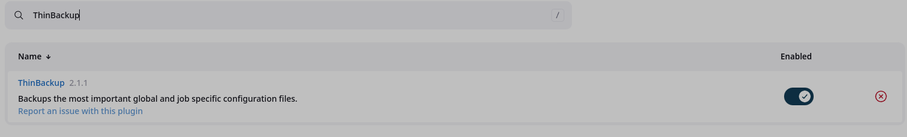

2. **Configure ThinBackup Plugin**

   a. Open ThinBackup Settings:

1. Go to **Manage Jenkins** from the Jenkins Dashboard.
1. Scroll down and select **ThinBackup** under the "Backup Management" section.

   b. Set the Backup Directory:

1. Click **Settings** in the ThinBackup plugin page.
1. In the **Backup directory** field, enter:

   `/var/lib/jenkins/jenkins_backup`

1. Adjust other settings such as:

   - **Full backup schedule**: Set the schedule for full backups ( `0 2 * * *` for daily backups at 2 AM).
   - **Differential backup schedule**: Schedule for incremental backups.
   - **Backup build results**: Check this option if you want to back up build logs and results.
   - **Backup userContent folder**: Check if you want to include user content in the backup.

1. Click **Save** to apply the settings.

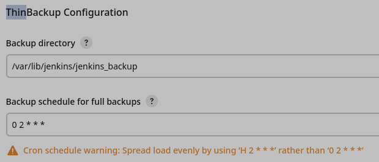

3. **Create the Backup Directory**

```
sudo mkdir -p /var/lib/jenkins/jenkins_backup
sudo chown -R jenkins:jenkins /var/lib/jenkins/jenkins_backup
```

4. **Test the Backup**

1. Go to **Manage Jenkins** > **ThinBackup**.
1. Click on **Backup Now** to trigger a manual backup.
1. Verify that backups are stored in `/var/lib/jenkins/jenkins_backup`.

1. **Verify Backup Schedule**

**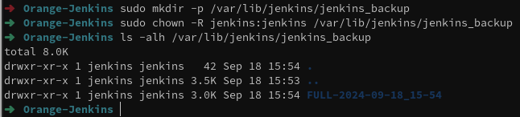**
Done!

### Create a Jenkins user as per the details provided below.

    A. Username: jenkins
    B. Password: jenk!n$
    C. Full Name: Orange DevOps

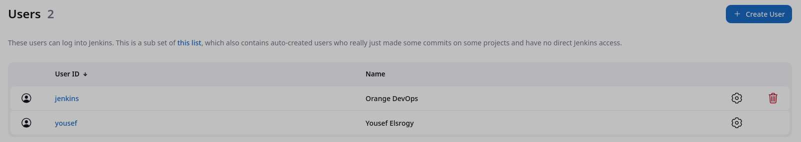

Install the Role-based Authorization Strategy plugin and enable the Role-Based Strategy authorization in Jenkins security settings.
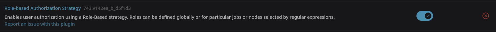
installed!

### Install the Role-based Authorization Strategy plugin and enable the Role-Based Strategy authorization in Jenkins security settings.

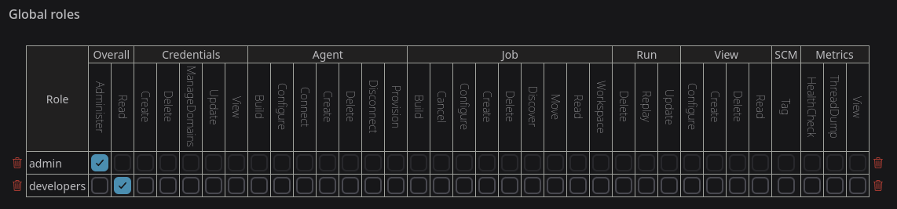

### Create a role named developers and make sure it has overall Read permissions alone. Also assign role called developers to the user called jenkins.

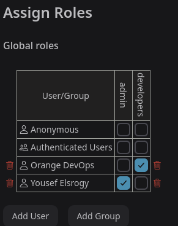

### First, install the Matrix Authorization Strategy plugin and using the Project-based Matrix Authorization Strategy assign some permissions that would allow jenkins to build the mytest job.

Once this is done, build this job through user jenkins.
Note: You should use jenkins's credentials from the previous question.

    Username: jenkins
    Password: jenk!n$

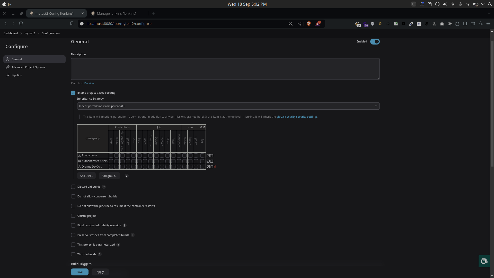

### Install Pipeline Jenkins plugin?

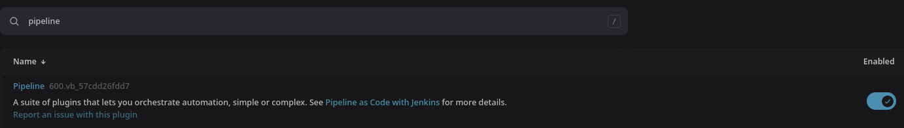

### Create a pipeline job named hello-world, it should just echo the Hello World string.

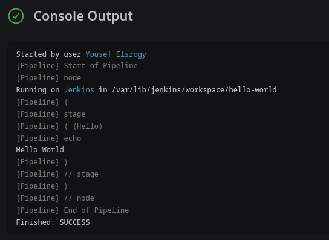
Done!

### Install SSH Build Agents Jenkins plugin.

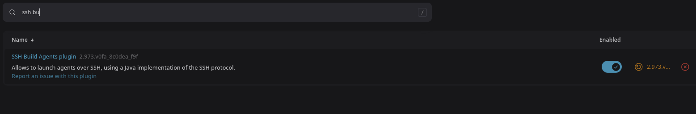

### Create a simple Jenkins job that prints "Hello, World!" in the console output. Set up a basic Freestyle job with a shell command to print a message.

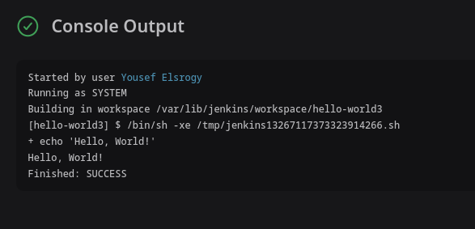

### Configure a Jenkins job to pull code from a public GitHub repository. Use the Git plugin to connect to the repository and check out the latest code.

![[Pasted image 20240919152111.png]]

### Set up a Jenkins job that triggers every 5 minutes using the "Build periodically" option. Use the cron syntax to configure the trigger.

![[Pasted image 20240919152159.png]]
![[Pasted image 20240919152221.png]]
![[Pasted image 20240919152240.png]]

### Install a Jenkins plugin from the Plugin Manager. Pick any plugin (Docker) and verify that it's successfully installed.

![[Pasted image 20240919152324.png]]
installed!

### Configure a Jenkins job to send email notifications when a build fails. Set up the Email Extension Plugin and define an email recipient list.

Configure Jenkins Job for Email Notifications
In the **Editable Email Notification** section
![[Pasted image 20240922065449.png]]
cause a failure
![[Pasted image 20240922070202.png]]

### Create a Jenkins pipeline with two stages:

    Stage 1: Pull code from GitHub(repo from your choise)
    Stage 2: Run a simple shell script that lists all files in the workspace.

![[Pasted image 20240922071339.png]]
Done!

### Set up a Jenkins job to archive log files generated by the build. Use the "Archive the artifacts" post-build action to store the logs.

![[Pasted image 20240922071924.png]]
the file:
![[Pasted image 20240922072021.png]]
Done

### Set up a Jenkins job to clean up old builds (e.g., only keep the last 5 builds). Configure the job to discard old builds using the "Discard Old Builds" option.

![[Pasted image 20240922074019.png]]
![[Pasted image 20240922073928.png]]
Done

### Create a Jenkins job that takes user input for a name and prints a greeting message in the console output (e.g., "Hello, [Name]!" ). Use the "This build is parameterized" option and add a string parameter.

![[Pasted image 20240922074411.png]]
![[Pasted image 20240922074423.png]]
![[Pasted image 20240922074353.png]]
Done!

### Set up a Jenkins job to build a Java project using the javac command. Ensure the job compiles a basic Java file and outputs the result.

![[Pasted image 20240922151143.png]]
![[Pasted image 20240922151858.png]]
![[Pasted image 20240922151837.png]]

### Create a Jenkins job that runs a script to check for disk space usage on the Jenkins server. Use a simple shell script in the build step to check the disk space (df -h on Linux).

![[Pasted image 20240922160156.png]]

### Create a Jenkins job that executes a Python script from the repository search for a repo or create one. Ensure the job pulls the script from GitHub and runs it.

![[Pasted image 20240922161415.png]]
Done!

### Configure a Jenkins job that runs on an agent (slave) node with specific labels ("linux"). Set up a node with a label and configure the job to run only on that node.

![[attachments/Pasted image 20240922162507.png]]
![[attachments/Pasted image 20240922162507.png]]
Done
