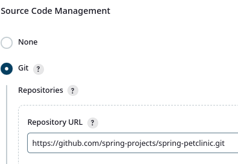
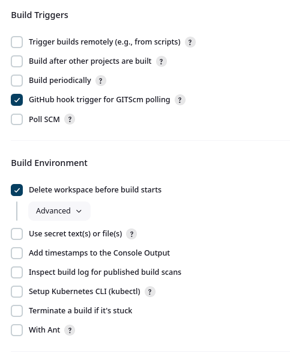
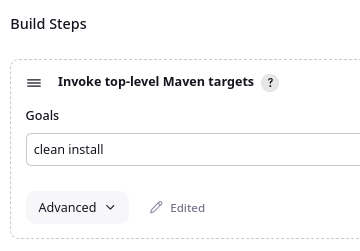
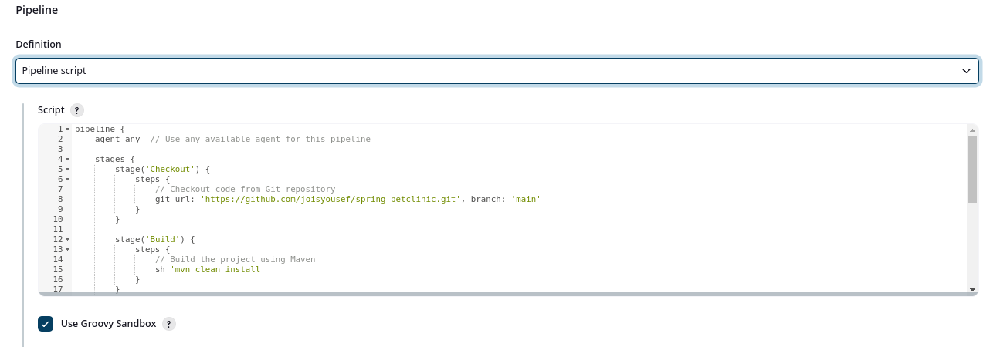
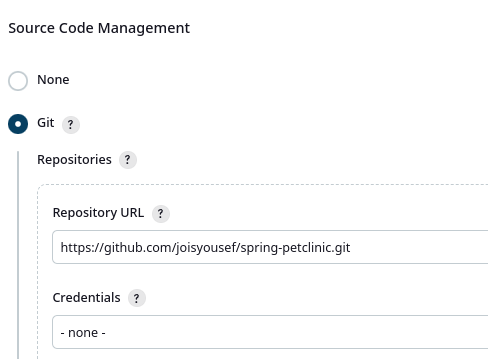
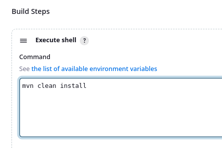
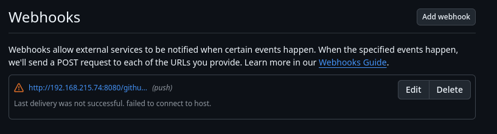
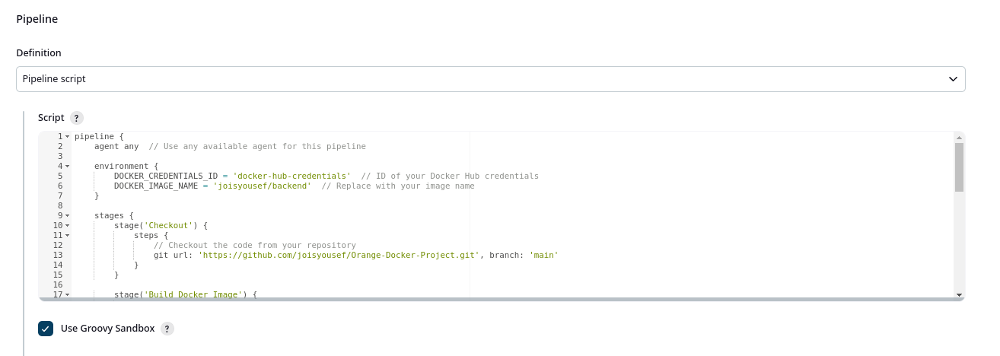

### Create a Jenkins Freestyle job that pulls code from a GitHub repository(from your choise) and builds it using Maven. Set up the job to trigger a build whenever there is a change in the GitHub repository.




Done!

### Configure a Jenkins pipeline job that checks out code from Git, builds it, and runs unit tests. Use declarative syntax for the pipeline.


Done!


### Set up a Jenkins job to trigger an automatic build whenever a push is made to the main branch of a GitHub repository and make sure that there is another branches. Use the Git plugin and a webhook to accomplish this.




add webhook

Done!

### Create a Jenkins job that builds a Docker image and pushes it to Docker Hub.Use Jenkins credentials to securely store your Docker Hub credentials.


```
pipeline {
    agent any  // Use any available agent for this pipeline

    environment {
        DOCKER_CREDENTIALS_ID = 'docker-hub-credentials'  // ID of your Docker Hub credentials
        DOCKER_IMAGE_NAME = 'joisyousef/backend'  // Replace with your image name
    }

    stages {
        stage('Checkout') {
            steps {
                // Checkout the code from your repository
                git url: 'https://github.com/joisyousef/Orange-Docker-Project.git', branch: 'main'
            }
        }

        stage('Build Docker Image') {
            steps {
                script {
                    // Build the Docker image
                    docker.build(DOCKER_IMAGE_NAME)
                }
            }
        }

        stage('Login to Docker Hub') {
            steps {
                // Login to Docker Hub using Jenkins credentials
                withCredentials([usernamePassword(credentialsId: DOCKER_CREDENTIALS_ID, usernameVariable: 'DOCKER_USERNAME', passwordVariable: 'DOCKER_PASSWORD')]) {
                    sh 'echo "$DOCKER_PASSWORD" | docker login -u "$DOCKER_USERNAME" --password-stdin'
                }
            }
        }

        stage('Push Docker Image') {
            steps {
                // Push the Docker image to Docker Hub
                sh "docker push ${DOCKER_IMAGE_NAME}"
            }
        }
    }

    post {
        success {
            echo 'Docker image built and pushed successfully!'
        }
        failure {
            echo 'There was a problem with the Docker image build or push.'
        }
    }
}

```
Done!

 
### Set up a Jenkins pipeline that sends notifications to a Slack channel upon build success or failure. configure Slack integration using the appropriate plugin.

pipline script
```
pipeline {
    agent any  // Use any available agent for this pipeline

    stages {
        stage('Checkout') {
            steps {
                // Checkout the code from your repository
                git url: 'https://github.com/joisyousef/Orange-Docker-Project.git', branch: 'main'
            }
        }

        stage('Build') {
            steps {
                // Example build step
                sh 'echo "Building the project..."'
            }
        }

        stage('Test') {
            steps {
                // Example test step
                sh 'echo "Running tests..."'
            }
        }
    }

    post {
        success {
            // Send notification to Slack on success
            slackSend(channel: '#your-channel', message: "Build succeeded for job: ${env.JOB_NAME} (${env.BUILD_NUMBER})!")
        }
        failure {
            // Send notification to Slack on failure
            slackSend(channel: '#your-channel', message: "Build failed for job: ${env.JOB_NAME} (${env.BUILD_NUMBER})!")
        }
    }
}

```

Done!

```
pipeline {
    agent any  // Use any available agent for this pipeline

    environment {
        DOCKER_IMAGE_NAME = 'joisyousef/backend'  // Replace with your Docker image name
        K8S_DEPLOYMENT_NAME = 'Deployment.yml'  // Replace with your Kubernetes deployment name
        K8S_NAMESPACE = 'default'  // Replace with your Kubernetes namespace if needed
    }

    stages {
        stage('Checkout') {
            steps {
                // Checkout the code from your Git repository
                git url: 'https://github.com/joisyousef/Orange-Kubernetes-Project.git', branch: 'main'
            }
        }

        stage('Build Docker Image') {
            steps {
                script {
                    // Build the Docker image
                    sh "docker build -t ${DOCKER_IMAGE_NAME} ."
                }
            }
        }

        stage('Push Docker Image') {
            steps {
                script {
                    // Login to Docker Hub (ensure credentials are stored in Jenkins)
                    withCredentials([usernamePassword(credentialsId: 'docker-hub-credentials', usernameVariable: 'DOCKER_USERNAME', passwordVariable: 'DOCKER_PASSWORD')]) {
                        sh 'echo "$DOCKER_PASSWORD" | docker login -u "$DOCKER_USERNAME" --password-stdin'
                    }
                    // Push the Docker image to Docker Hub
                    sh "docker push ${DOCKER_IMAGE_NAME}"
                }
            }
        }

        stage('Deploy to Kubernetes') {
            steps {
                script {
                    // Deploy to Kubernetes using kubectl
                    // Ensure kubectl is configured to access your cluster
                    sh "kubectl set image deployment/${K8S_DEPLOYMENT_NAME} ${K8S_DEPLOYMENT_NAME}=${DOCKER_IMAGE_NAME} -n ${K8S_NAMESPACE}"
                    // Optionally apply the deployment yaml if you have it
                    // sh "kubectl apply -f path/to/deployment.yaml -n ${K8S_NAMESPACE}"
                }
            }
        }
    }

    post {
        success {
            echo 'Deployment to Kubernetes was successful!'
        }
        failure {
            echo 'There was an error during the deployment.'
        }
    }
}

```
Done!